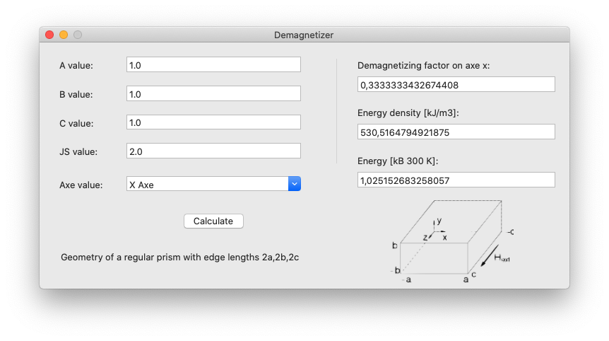

Calculate demagnetizer factor for a prism in the 3-axis

## References

[1] Amikam Aharoni, "Demagnetizing factors for rectangular ferromagnetic prisms"
J. Appl. Phys. 83 (1998) 3432 [[ J. Appl. Phys. 1 ]](http://dx.doi.org/10.1063/1.367113), [[ J. Appl. Phys. 2 ]](http://link.aip.org/link/?JAPIAU/83/3432/1)

magpar - Parallel Finite Element Micromagnetics Package 
Copyright (C) 2002-2010 Werner Scholz <nr/>
[DemagCalc](http://www.magpar.net/static/magpar/doc/html/demagcalc.html)
